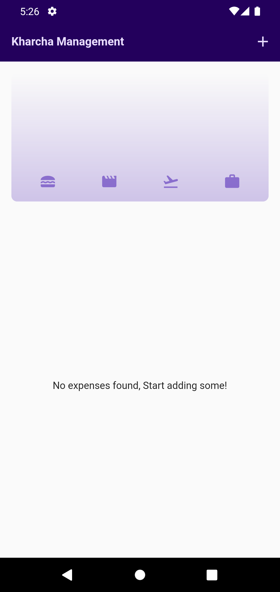
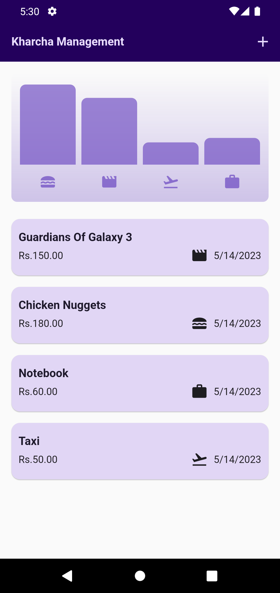
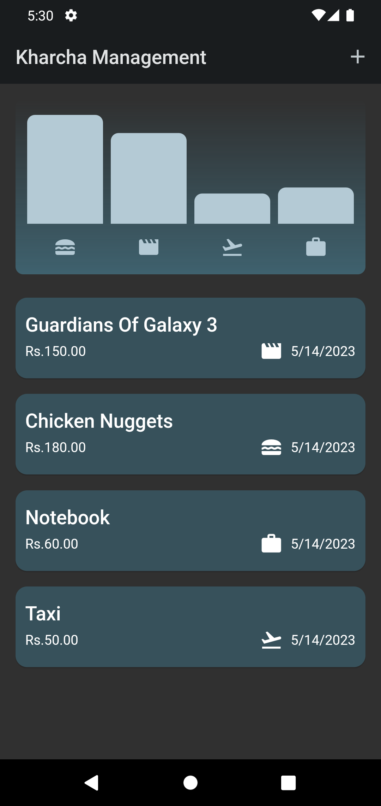
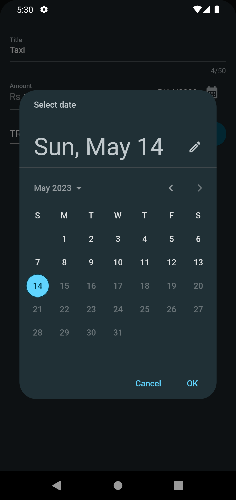

# kharcha_management_app

Kharcha Management is an expense tracker app created with Flutter.

## Show some :heart: and star the repo to support the project.

## Note
This repository is still under development and I will continue to add more features to it.

## Features

 * Actions
   * Add Expense
   * Delete Expense
   * Undo Delete Expense 
 * Expense Category
   * Food
   * Travel
   * Work
   * Leisure
 * Theme
    * LightTheme
    * DarkTheme
 
 
 
## Screenshots

### LightTheme

Screen 1               |  Screen 2                         | Screen 3        
:-------------------------:|:-------------------------:|:-------------------------:|
|||

### DarkTheme

Screen 4                   |              Screen 5               |  Screen 6     
:-------------------------:|:-------------------------:|:-------------------------:
||

